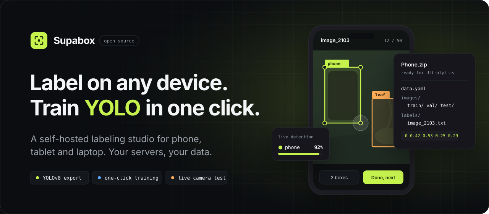
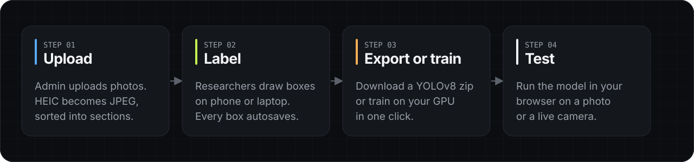

<div align="center">

<picture>
  <source media="(prefers-color-scheme: dark)" srcset="docs/assets/banner-dark.svg">
  <source media="(prefers-color-scheme: light)" srcset="docs/assets/banner-light.svg">
  
</picture>

<br>
<br>

<p>
  <a href="#self-host-in-15-minutes"></a>
  <a href="https://nextjs.org"></a>
  <a href="https://supabase.com"></a>
  <a href="https://docs.ultralytics.com"></a>
  <a href="LICENSE"></a>
</p>

<p>
  <a href="#self-host-in-15-minutes"><b>Self-host</b></a>
  &nbsp;&middot;&nbsp;
  <a href="#features"><b>Features</b></a>
  &nbsp;&middot;&nbsp;
  <a href="#one-click-local-training"><b>Local training</b></a>
  &nbsp;&middot;&nbsp;
  <a href="#export-format"><b>Export format</b></a>
  &nbsp;&middot;&nbsp;
  <a href="#faq"><b>FAQ</b></a>
</p>

</div>

<br>

Training a computer vision model is the easy part. **Getting hundreds of labeled images is the hard part.**
Most labeling tools keep your images on someone else's servers, and many are painful to use on anything but a desktop.

**Supabox** is a website, so it works on any device with a browser: phone, tablet or laptop. An admin uploads photos, researchers draw bounding boxes with a finger or a mouse, and you get a dataset that Ultralytics YOLO trains on directly. Or skip the export and train on your own GPU with a single click.

It runs on **your** Vercel and **your** Supabase, so your images never leave infrastructure you control. Both free tiers are enough to start.

<br>

<picture>
  <source media="(prefers-color-scheme: dark)" srcset="docs/assets/workflow-dark.svg">
  <source media="(prefers-color-scheme: light)" srcset="docs/assets/workflow-light.svg">
  
</picture>

<br>

## Who it's for

<table>
  <tr>
    <td width="33%" valign="top">
      <h3>Research teams</h3>
      Spread labeling across the whole lab. Everyone labels on whatever they have: a laptop at their desk or a phone in the field.
    </td>
    <td width="33%" valign="top">
      <h3>Thesis groups and classes</h3>
      Nobody needs special hardware or software to contribute. Split the work by sections of 50 and watch progress fill in.
    </td>
    <td width="33%" valign="top">
      <h3>Teams that own their data</h3>
      Self-hosted on your accounts. No third-party labeling service, no vendor lock-in, MIT licensed.
    </td>
  </tr>
</table>

## Features

<table>
  <tr>
    <td width="50%" valign="top">
      <h4>Labeler for any screen</h4>
      Touch-friendly on phones and tablets (one-finger boxes, pinch to zoom), with mouse and keyboard shortcuts on laptops. Every box autosaves.
    </td>
    <td width="50%" valign="top">
      <h4>YOLOv8 export, ready to train</h4>
      One click downloads <code>images/</code>, <code>labels/</code> (normalized <code>class cx cy w h</code>) and <code>data.yaml</code>, split into train, val and test.
    </td>
  </tr>
  <tr>
    <td valign="top">
      <h4>One-click local training</h4>
      Creates a Python venv, installs Ultralytics and trains on Apple GPU, CUDA or CPU. Live steps, percent, ETA and a stop button. No terminal.
    </td>
    <td valign="top">
      <h4>Live model testing</h4>
      Runs your trained model in the browser with ONNX Runtime and WebGPU. Test on an uploaded photo or your live camera feed.
    </td>
  </tr>
  <tr>
    <td valign="top">
      <h4>Uploads that save space</h4>
      JPEG, PNG, WebP and iPhone HEIC are converted in the browser to compressed JPEG (max 1280px) with thumbnails, so the free 1 GB lasts.
    </td>
    <td valign="top">
      <h4>Sections of 50</h4>
      Large datasets are grouped into sections so teams can divide the work. Finish one and "Proceed to Section N" takes you to the next.
    </td>
  </tr>
  <tr>
    <td valign="top">
      <h4>Roles and security</h4>
      Admins manage datasets, users and exports; labelers label. Enforced by Postgres Row Level Security and a private storage bucket.
    </td>
    <td valign="top">
      <h4>Built for the free tier</h4>
      Storage meter, consistent file naming (<code>image_2103</code>, <code>image_2104</code>, ...) and a safe reset after export to start the next batch.
    </td>
  </tr>
</table>

<br>

## Self-host in 15 minutes

> **You need:** a free [Supabase](https://supabase.com) account, a free [Vercel](https://vercel.com) account, GitHub and Node.js 20 or newer.

<details open>
<summary><b>1. Clone and install</b></summary>
<br>

```bash
git clone https://github.com/Danncode10/Supabox.git
cd Supabox
npm install
cp .env.example .env.local
```

Fork the repo first if you plan to deploy your own copy to Vercel.

</details>

<details open>
<summary><b>2. Create a Supabase project and fill in <code>.env.local</code></b></summary>
<br>

Create a project at [supabase.com/dashboard](https://supabase.com/dashboard), then copy these from **Project Settings**:

| Variable | Where to find it |
| --- | --- |
| `NEXT_PUBLIC_SUPABASE_URL` | **Data API** &rarr; Project URL, e.g. `https://<ref>.supabase.co` |
| `NEXT_PUBLIC_SUPABASE_ANON_KEY` | **API Keys** &rarr; Publishable key (`sb_publishable_...`) or legacy anon key |
| `SUPABASE_SERVICE_ROLE_KEY` | **API Keys** &rarr; Secret key (`sb_secret_...`) or legacy service_role key. **Server-only, never commit it.** |

</details>

<details open>
<summary><b>3. Create the database</b></summary>
<br>

Tables, security policies, functions and the private `images` bucket all live in one migration.

**SQL Editor (easiest):** Dashboard &rarr; SQL Editor &rarr; New query &rarr; paste
[`supabase/migrations/20261008000000_init_supabox.sql`](supabase/migrations/20261008000000_init_supabox.sql) &rarr; Run.

**Or the CLI:**

```bash
npx supabase login
npm run db:link       # pick your project
npm run db:migrate    # applies supabase/migrations/
```

</details>

<details open>
<summary><b>4. Turn off public sign-ups</b></summary>
<br>

Dashboard &rarr; **Authentication &rarr; Sign In / Providers**: keep **Email** on, turn **Allow new users to sign up** off. Admins create every account.

</details>

<details open>
<summary><b>5. Make yourself admin</b></summary>
<br>

Create a user under **Authentication &rarr; Users &rarr; Add user** (tick *Auto Confirm User*), then run:

```sql
update public.profiles set role = 'admin' where email = 'you@example.com';
```

After that, add teammates from **Admin &rarr; Users** inside the app.

</details>

<details open>
<summary><b>6. Run locally</b></summary>
<br>

```bash
npm run dev
```

Open [localhost:3000](http://localhost:3000). Phones and other devices on the same Wi-Fi can open `http://<your-computer-ip>:3000`.

</details>

<details open>
<summary><b>7. Deploy to Vercel</b></summary>
<br>

1. Import your fork at [vercel.com/new](https://vercel.com/new).
2. Add the same three variables under **Settings &rarr; Environment Variables**.
3. Deploy and share the URL. Your team can now label from anywhere.

The deployed site handles uploading, labeling, exporting and testing. Training stays on your own machine.

</details>

<br>

## One-click local training

Training needs a GPU and Python, so it only runs when you open Supabox on **localhost** with `npm run dev`. The deployed site never runs Python.

<table>
  <tr>
    <td width="25%" valign="top"><b>1. Open</b><br>Run <code>npm run dev</code>, open <code>localhost:3000</code>, pick a dataset and go to <b>Testing</b>.</td>
    <td width="25%" valign="top"><b>2. Set up once</b><br>Click <b>Set up</b>. Supabox creates <code>.venv/</code> and installs Ultralytics (about 1 GB).</td>
    <td width="25%" valign="top"><b>3. Train</b><br>Pick Quick (25), Normal (50) or Thorough (100) epochs and click <b>Train</b>.</td>
    <td width="25%" valign="top"><b>4. Test</b><br>The model loads automatically. Try a photo or your live camera.</td>
  </tr>
</table>

| Hardware | Device used |
| --- | --- |
| Apple Silicon Mac | GPU via MPS |
| NVIDIA GPU | CUDA |
| Anything else | CPU (slower, still works) |

Everything is written to gitignored folders: `.venv/` for Python and `models/<dataset-id>/` for the data, training runs, `best.onnx` and `meta.json`.
Requires `python3` on your PATH. macOS and Linux work out of the box; on Windows, use WSL.

> [!TIP]
> Few or no boxes when testing? Small datasets (under about 100 images) produce unsure models. Label more varied photos, with different backgrounds, lighting and angles plus some without the object, and train with **Thorough**. When nothing clears the confidence slider, the Testing tab shows the model's strongest guess.

<details>
<summary><b>Prefer the terminal, Colab or Kaggle?</b></summary>
<br>

Download the zip from the **Export** tab, then:

```bash
pip install ultralytics
unzip MyDataset.zip -d MyDataset && cd MyDataset
yolo detect train data=data.yaml model=yolov8n.pt epochs=100 imgsz=640
```

To test a model trained elsewhere in Supabox, export it with `yolo export model=best.pt format=onnx opset=12` and load it with **Use another .onnx file** in the Testing tab.

</details>

<br>

## Export format

<table>
<tr>
<td width="50%" valign="top">

```text
MyDataset.zip
├── data.yaml
├── images/
│   ├── train/image_2103.jpg
│   ├── val/
│   └── test/
└── labels/
    ├── train/image_2103.txt
    ├── val/
    └── test/
```

</td>
<td width="50%" valign="top">

```yaml
# data.yaml
path: .
train: images/train
val: images/val
nc: 2
names:
  0: "phone"
  1: "charger"
```

```text
# labels/train/image_2103.txt
# class  cx     cy     w      h   (0-1)
0  0.4194 0.5279 0.2473 0.2885
```

</td>
</tr>
</table>

Classes are renumbered to `0..N-1` in index order, so the export always matches what Ultralytics expects.

<br>

## Built with

<table>
  <tr>
    <td valign="top"><b>App</b><br>Next.js 16 (App Router, Cache Components, Turbopack), React 19, Tailwind CSS 4</td>
    <td valign="top"><b>Backend</b><br>Supabase Postgres with Row Level Security, Auth, private Storage with signed URLs</td>
    <td valign="top"><b>Vision</b><br>Ultralytics YOLOv8, onnxruntime-web (WebGPU, WASM fallback), heic-to</td>
  </tr>
</table>

<details>
<summary><b>Project structure</b></summary>
<br>

```text
src/
├── app/                   routes: /login, /admin, /label, API routes
├── components/
│   ├── admin/             dashboard, uploader, export, testing, training
│   ├── annotator/         the touch-first labeling workspace
│   └── ui/                shared UI primitives
└── lib/
    ├── supabase/          server and browser clients, signed URL cache
    ├── yolo/              export builder, YOLOv8 decode and NMS (tested)
    └── training.ts        local training jobs
scripts/train_local.py     trains, exports ONNX, reports progress
supabase/migrations/       the whole database in SQL
```

</details>

<details>
<summary><b>npm scripts</b></summary>
<br>

| Command | What it does |
| --- | --- |
| `npm run dev` | Dev server on `0.0.0.0:3000`, reachable from phones on your Wi-Fi |
| `npm run build` / `start` | Production build and server |
| `npm run lint` / `typecheck` | ESLint and `tsc --noEmit` |
| `npm run test:yolo` | YOLO export tests |
| `npm run test:detect` | YOLO decode and NMS tests |
| `npm run db:link` | Link the repo to your Supabase project (once) |
| `npm run db:migrate` | Push `supabase/migrations/` |
| `npm run db:generate` | Create a migration from schema changes |
| `npm run db:pull` / `db:compare` | Pull the remote schema / diff against it |
| `npm run db:types` | Regenerate `src/types/supabase.ts` |

</details>

<br>

## Security

- Row Level Security on every table. Labelers read and label; only admins manage datasets, users and files.
- The `images` bucket is private. The app serves images through short-lived signed URLs.
- `SUPABASE_SERVICE_ROLE_KEY` is used only in server routes and never reaches the browser.
- Public sign-up is off. Accounts are created by an admin.
- Local training refuses to run unless the request comes from `localhost` in development.

More detail in [`docs/SETUP.md`](docs/SETUP.md).

<br>

## FAQ

<details>
<summary><b>What devices does it work on?</b></summary>
<br>
Any device with a modern browser: phone, tablet or laptop. Open the deployed URL in any browser, sign in and start drawing boxes.
</details>

<details>
<summary><b>Is it free?</b></summary>
<br>
The software is MIT licensed. Hosting fits within Vercel Hobby and Supabase Free for small and medium datasets: 1 GB of storage holds roughly 3,000 to 5,000 compressed photos.
</details>

<details>
<summary><b>Where are my images stored?</b></summary>
<br>
In the private bucket of your own Supabase project. Nothing is sent anywhere else.
</details>

<details>
<summary><b>I filled the free storage. What now?</b></summary>
<br>
Export the zip, then use <b>Settings &rarr; Reset dataset</b> to clear the images and boxes and start the next batch.
</details>

<details>
<summary><b>Can I train on the Vercel deployment?</b></summary>
<br>
No. Training needs Python and a GPU, so it runs on your own computer through localhost. For cloud GPUs, use the export.
</details>

<details>
<summary><b>Does it support segmentation or classification?</b></summary>
<br>
Bounding-box detection only for now. Contributions are welcome.
</details>

<br>

## Roadmap

- [ ] Model-assisted labeling: pre-fill boxes with your latest model
- [ ] Per-labeler stats and a review queue
- [ ] Segmentation masks
- [ ] Docker setup for fully self-hosted Supabase

Have an idea? [Open an issue](https://github.com/Danncode10/Supabox/issues).

## Contributing

Pull requests are welcome. Read [CONTRIBUTING.md](CONTRIBUTING.md) for setup and the checks to run before you open one.

<br>

<div align="center">
<sub>MIT License &copy; 2026 Lester Dann Lopez. If Supabox helps your research, a star on the repo helps others find it.</sub>
</div>
